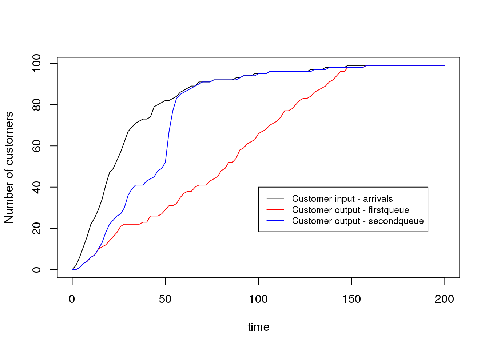
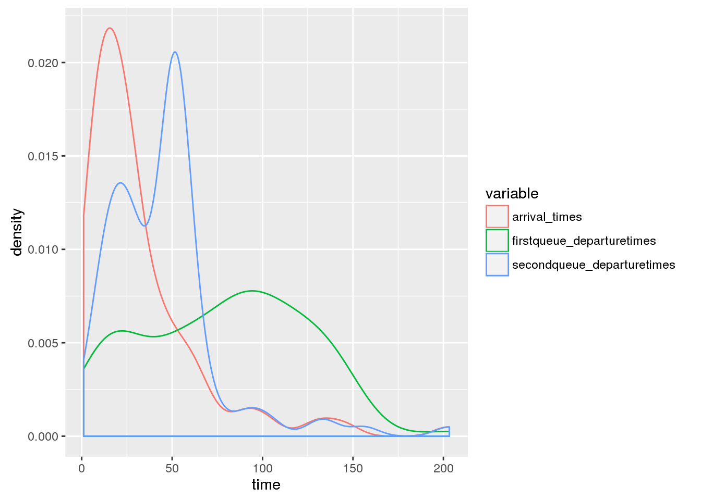
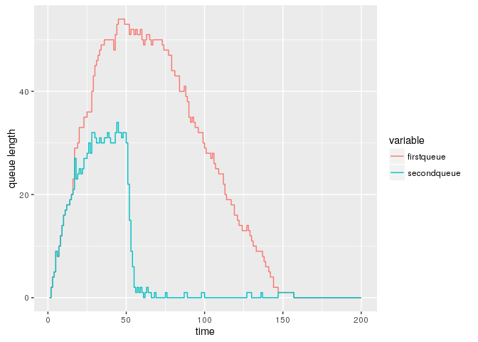

<!-- README.md is generated from README.Rmd. Please edit that file -->
\[ \]

Install
=======

``` r
devtools::install_github("AnthonyEbert/queuecomputer")
library(queuecomputer)
```

    #> Loading queuecomputer

Why more queueing software?
===========================

There is already a lot of queueing simulation packages out there including the following R packages:

-   [liqueueR](https://cran.r-project.org/web/packages/liqueueR/index.html),
-   [queueing](https://cran.r-project.org/web/packages/queueing/index.html) &
-   [rstackdeque](https://cran.r-project.org/web/packages/rstackdeque/index.html).
-   [simmer](http://r-simmer.org/)

So what does this package do differently to the others?

The focus of this package is on <b>queue computation</b> rather than <b>queue simulation</b>. Existing queue simulation software are highly constrained in arrival distributions, this package decouples sampling and queue computation to free the user to specify any arrival or service process.

This package was inspired by the problem of modelling passenger flows through an international airport terminal. Batch arrivals (planes) occur throughout the day at predetermined times at different parts of the airport. A completely flexible queueing framework is needed to allow for arbitrary arrival and service distributions and resource schedules. An efficient computation engine is needed to allow for Bayesian sampling.

Simulating arbitrary queues is difficult, however once:

1.  The arrival times \(t^a\) and service times \(s\) are known for all customers and,
2.  the server resource schedule is specified

then the departure times \(t^d\) for all customers can be computed exactly.

The focus on this package is:

-   fast computation of departure times given arrival and service times, and
-   a flexible framework to allow for extensions such as server effects.

It is up to the user to provide arrival and service times, and therefore very complicated distributions can be simulated (by the user) and tested with this package.

Example
=======

In this example the arrival process is log-normal and the service times are log-normal. We compare two different queue scenarios, the first `firstqueue` with a single server throughout the day and the second `secondqueue` with 1 server until time 15, 3 servers from time 15 to time 30, 1 server from time 30 to time 50 and 10 servers from there onwards.

``` r
library(ggplot2)
library(reshape2)
library(magrittr)

set.seed(700)
arrival_df <- data.frame(ID = c(1:100), times = rlnorm(100, meanlog = 3))
service <- rlnorm(100)
server_list <- server_split(c(15,30,50),c(1,3,1,10))

firstqueue <- queue_step(arrival_df = arrival_df, service = service)
secondqueue <- queue_step(arrival_df = arrival_df,
    server_list = server_list, service = service, queueoutput = TRUE)
```

Print secondqueue output ordered by arrival times
-------------------------------------------------

``` r
ord <- order(arrival_df$times)

first_queueoutput <- data.frame(ID = arrival_df$ID[ord], arrivals = arrival_df$times[ord], service = service[ord],
    departure = firstqueue$times[ord])

second_queueoutput <- data.frame(ID = arrival_df$ID[ord], arrivals = arrival_df$times[ord], service = service[ord],
    departure = secondqueue$times[ord], serverID = secondqueue$queue[ord])

second_queueoutput[1:50,]
#>    ID  arrivals     service departure serverID
#> 1  63  1.061725  2.01307780  3.074803        1
#> 2  88  1.488319  1.96525722  5.040060        1
#> 3  42  2.723766  0.30952181  5.349582        1
#> 4  80  2.908758  1.46215112  6.811733        1
#> 5  30  3.377003  1.28021358  8.091947        1
#> 6   4  3.522079  0.80650222  8.898449        1
#> 7  99  4.802027  1.17292296 10.071372        1
#> 8  52  4.814366  2.22906647 12.300438        1
#> 9  33  4.821817  0.70798823 13.008427        1
#> 10 14  4.897423  0.86110290 13.869530        1
#> 11 15  5.704956  0.63322402 14.502754        1
#> 12 74  6.383100  2.72938384 17.232137        1
#> 13 65  6.858535  0.77688315 15.776883        2
#> 14 60  6.881756  0.05873893 15.058739        3
#> 15 61  7.061939  2.40062563 17.459365        3
#> 16 31  7.474810  1.40151084 17.178394        2
#> 17 10  8.185190  0.94207223 18.120466        2
#> 18  8  8.212469  0.23593588 17.468073        1
#> 19 71  8.444148  1.74449802 19.203863        3
#> 20 93  8.766556  0.32719669 17.795270        1
#> 21 16  9.047441  0.43494748 18.230217        1
#> 22  9  9.100634  1.35686034 19.477327        2
#> 23 72 10.311166 10.09251124 28.322729        1
#> 24 18 10.804171  3.44351122 22.647374        3
#> 25 76 11.720475  0.98884489 20.466171        2
#> 26 45 12.017232  0.07720980 20.543381        2
#> 27 67 13.030232  6.17775768 26.721139        2
#> 28 79 13.308661  0.56781022 23.215184        3
#> 29 35 13.659027  1.41835111 24.633535        3
#> 30 48 14.066098  1.72667183 26.360207        3
#> 31 77 14.272732  0.33625943 26.696466        3
#> 32 62 15.596647  2.53880672 29.235273        3
#> 33 70 15.687771  1.94895263 28.670092        2
#> 34  2 15.975132  0.25945200 28.582181        1
#> 35  6 16.153044  0.66391471 29.246095        1
#> 36 19 16.168960  2.00270633 30.672798        2
#> 37 57 16.186088  0.60314611 29.838419        3
#> 38 49 16.488483  0.81938725 30.065483        1
#> 39 95 16.560112  3.60356382 33.441983        3
#> 40 36 16.848182  1.45763528 31.523118        1
#> 41 92 17.124419  1.84136610 33.364484        1
#> 42  1 18.396847  4.65579089 38.020275        1
#> 43  3 18.461777  1.44118444 39.461459        1
#> 44 81 18.742626  0.61029266 40.071752        1
#> 45 27 19.268697  2.57540186 42.647154        1
#> 46 68 19.278342  1.58126057 44.228414        1
#> 47 24 19.686917  0.17840810 44.406823        1
#> 48 66 20.379716  0.35094449 44.757767        1
#> 49 12 21.836983  1.30155003 46.059317        1
#> 50 44 22.764804  2.98207936 49.041396        1
```

Plot customers arrived and customers served
-------------------------------------------

``` r

curve(ecdf(arrival_df$times)(x) * 100 , from = 0, to = 200,
    xlab = "time", ylab = "Number of customers")
curve(ecdf(firstqueue$times)(x) * 100 , add = TRUE, col = "red")
curve(ecdf(secondqueue$times)(x) * 100, add = TRUE, col = "blue")
legend(100,40, legend = c("Customer input - arrivals",
    "Customer output - firstqueue",
    "Customer output - secondqueue"),
    col = c("black","red","blue"), lwd = 1, cex = 0.8
)
```



Plot densities
--------------

``` r
departure_df <- data.frame(arrival_times = arrival_df$times, 
  firstqueue_departuretimes = firstqueue$times, 
  secondqueue_departuretimes = secondqueue$times) %>% reshape2::melt()
#> No id variables; using all as measure variables

qplot(value, data = departure_df, colour = variable, geom = "density") + xlab("time")
```



Plot queue lengths
------------------

``` r
#queue lengths ------------

ecdf_df <- data.frame(time = c(1:200), 
  firstqueue = ecdf(arrival_df$times)(c(1:200)) * 100 - 
    ecdf(firstqueue$times)(c(1:200))*100, 
  secondqueue = ecdf(arrival_df$times)(c(1:200))*100 - 
    ecdf(secondqueue$times)(c(1:200))*100) %>% reshape2::melt(id.vars = "time")

head(ecdf_df)
#>   time   variable value
#> 1    1 firstqueue     0
#> 2    2 firstqueue     2
#> 3    3 firstqueue     4
#> 4    4 firstqueue     5
#> 5    5 firstqueue     9
#> 6    6 firstqueue     8

qplot(time, value, data = ecdf_df, colour = variable, geom = "step") + xlab("time") + ylab("queue length")
```



Summary statistics
------------------

``` r
first_waiting_time <- (first_queueoutput$departure - first_queueoutput$service - first_queueoutput$arrival)
second_waiting_time <- (second_queueoutput$departure - second_queueoutput$service - second_queueoutput$arrival)

first_waiting_time %>% summary
#>    Min. 1st Qu.  Median    Mean 3rd Qu.    Max. 
#>    0.00   16.56   52.89   44.53   68.66   73.99
second_waiting_time %>% summary
#>    Min. 1st Qu.  Median    Mean 3rd Qu.    Max. 
#>   0.000   4.450   9.073  11.180  19.680  26.400
```

References
==========
