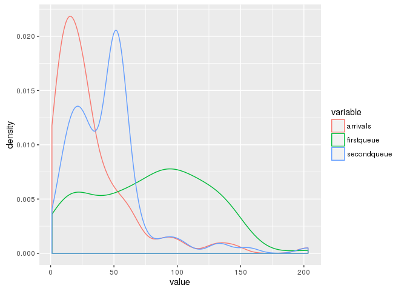
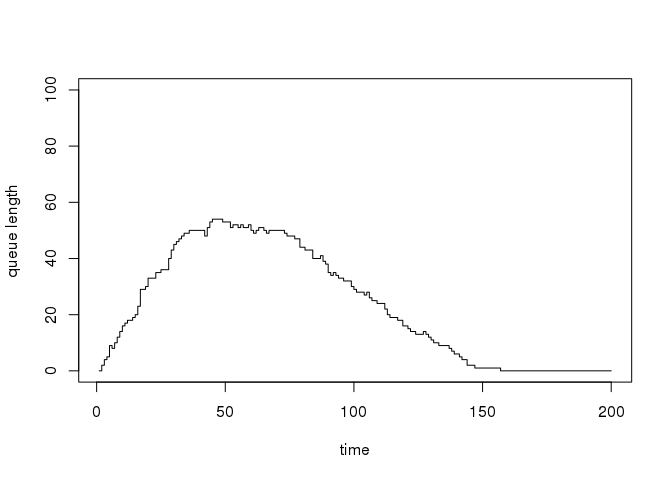
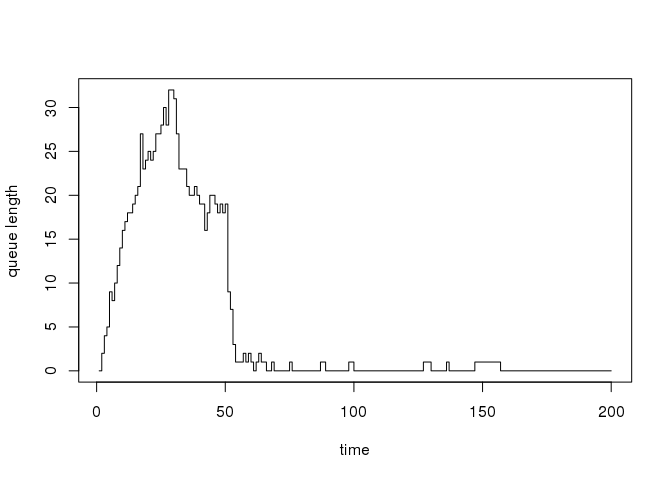

<!-- README.md is generated from README.Rmd. Please edit that file -->
queuecomputer
=============

\[ \]

Install
-------

``` r
devtools::install_github("AnthonyEbert/queuecomputer")
library(queuecomputer)
```

    #> Loading queuecomputer

Why more queueing software?
---------------------------

There is already a lot of queueing simulation packages out there including the following R packages:

-   [liqueueR](https://cran.r-project.org/web/packages/liqueueR/index.html),
-   [queueing](https://cran.r-project.org/web/packages/queueing/index.html) &
-   [rstackdeque](https://cran.r-project.org/web/packages/rstackdeque/index.html).
-   [simmer](http://r-simmer.org/)

So what does this package do differently to the others?

The focus of this package is on queue computation rather than queue simulation. Existing queue simulation software are highly constrained in arrival distributions, this package decouples sampling and queue computation to free the user to specify any sampling distribution.

This package was inspired by the problem of modelling passenger flows through an international airport terminal. Batch arrivals (planes) occur throughout the day at predetermined times at different parts of the airport. A completely flexible queueing framework is needed to allow for the potentially complex arrival and service distributions and resource schedules. An efficient computation engine is needed to allow for Bayesian sampling of the parameters to return posteriors for the queue parameters.

Simulating arbitrary queues is difficult, however once:

1.  The arrival times \(t^a\) and service times \(s\) are known for all customers and,
2.  the server resource schedule is specified

then the departure times \(t^d\) for all customers can be computed exactly.

The focus on this package is:

-   fast computation of departure times given arrival and service times, and
-   a flexible framework to allow for extensions such as server effects.

It is up to the user to provide arrival and service times, and therefore very complicated distributions can be simulated (by the user) and tested with this package.

``` r
set.seed(700)
arrival_df <- data.frame(ID = c(1:100), times = rlnorm(100, meanlog = 3))
service <- rlnorm(100)
server_list <- server_split(c(15,30,50),c(1,3,1,10))

firstqueue <- queue_step(arrival_df = arrival_df, service = service)
secondqueue <- queue_step(arrival_df = arrival_df,
    server_list = server_list, service = service)

curve(ecdf(arrival_df$times)(x) * 100 , from = 0, to = 200,
    xlab = "time", ylab = "Number of customers")
curve(ecdf(firstqueue$times)(x) * 100 , add = TRUE, col = "red")
curve(ecdf(secondqueue$times)(x) * 100, add = TRUE, col = "blue")
legend(100,40, legend = c("Customer input - arrivals",
    "Customer output - firstqueue",
    "Customer output - secondqueue"),
    col = c("black","red","blue"), lwd = 1, cex = 0.8
)
```


``` r

#plot densities --------------
plot(density(arrival_df$times, from = 0, adjust = 0.5))
lines(density(firstqueue$times, from = 0, adjust = 0.5), col = "red")
lines(density(secondqueue$times, from = 0, adjust = 0.5), col = "blue")
```



``` r

#queue lengths ------------
plot(ecdf(arrival_df$times)(c(1:200))*100 - ecdf(firstqueue$times)(c(1:200))*100, type = "s", 
  xlab = "time", ylab = "queue length", ylim = c(0, 100))
```



``` r
plot(ecdf(arrival_df$times)(c(1:200))*100 - ecdf(secondqueue$times)(c(1:200))*100, type = "s", 
  xlab = "time", ylab = "queue length", ylim = c(0, 100))
```



References
==========
