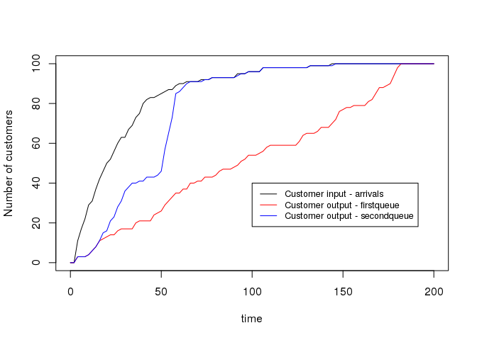

<!-- README.md is generated from README.Rmd. Please edit that file -->
queuecomputer
=============

\[ \]

Install
-------

``` r
devtools::install_github("AnthonyEbert/queuecomputer")
library(queuecomputer)
```

    #> Loading queuecomputer

Why more queueing software?
---------------------------

There is already a lot of queueing software out there including the following R packages:

-   [liqueueR](https://cran.r-project.org/web/packages/liqueueR/index.html),
-   [queueing](https://cran.r-project.org/web/packages/queueing/index.html) &
-   [rstackdeque](https://cran.r-project.org/web/packages/rstackdeque/index.html).

So what does this package do differently to the others?

-   liquet: I have no idea what this does or how this works (it's written by someone who does CS), something to do with Priority Queues,
-   queueing: is for queue simulation with certain standard arrival distributions,
-   rstackdeque: No idea

The focus of this package is on queue computation rather than queue simulation. Real world queues have all sorts of strange arrival and service distributions so this can make the job of queue simulation difficult. However once

1.  The arrival times \(t^a\) and service times \(s\) are known for all customers and,
2.  the number of service desks is specified

then the departure times \(t^d\) for all customers can be computed exactly. The computation of departure times for a single desk FIFO (first-in-first-out) queue is simple:

\[ t_k^d = \text{max}(t_k^a, t^d_{k-1}) + s_k \]

where \(t_k^d\), \(t_k^a\) and \(s_k\) are the departure, arrival and service time for the \(k\)th customer respectively, see (Sutton and Jordan (2011), pg 258).

it is up to the user to specify that - this package takes any vector of arrival times and any vector of service times and outputs the response times.

This package was inspired by the problem of modelling passenger flows through an international airport terminal.

``` r
arrival_df <- data.frame(ID = c(1:100), times = rlnorm(100, meanlog = 3))
service <- rlnorm(100)
firstqueue <- queue_step(arrival_df = arrival_df, service = service)
secondqueue <- queue_step(arrival_df = arrival_df,
    Number_of_queues = stepfun(c(15,30,50), c(1,3,1,10)), service = service)

curve(ecdf(arrival_df$times)(x) * 100 , from = 0, to = 200,
    xlab = "time", ylab = "Number of customers")
curve(ecdf(firstqueue$times)(x) * 100 , add = TRUE, col = "red")
curve(ecdf(secondqueue$times)(x) * 100, add = TRUE, col = "blue")
legend(100,40, legend = c("Customer input - arrivals",
    "Customer output - firstqueue",
    "Customer output - secondqueue"),
    col = c("black","red","blue"), lwd = 1, cex = 0.8
)
```



References
==========

Sutton, Charles, and Michael I Jordan. 2011. “Bayesian Inference for Queueing Networks and Modeling of Internet Services.” *The Annals of Applied Statistics*. JSTOR, 254–82.
