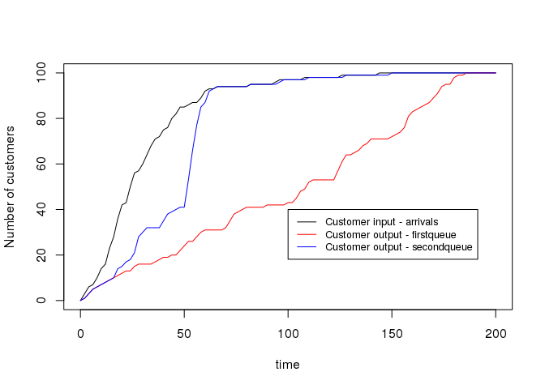

[](https://CRAN.R-project.org/package=queuecomputer) [](https://CRAN.R-project.org/package=queuecomputer) [](https://travis-ci.org/AnthonyEbert/queuecomputer) [](https://codecov.io/gh/AnthonyEbert/queuecomputer)

<!-- --- -->
<!-- output: html -->
<!-- bibliography: references.bib -->
<!-- --- -->
<!-- README.md is generated from README.Rmd. Please edit that file -->
queuecomputer
=============

Overview
--------

queuecomputer implements a new and computationally efficient method for simulating from a general set of queues. The current most popular method for simulating queues is Discete Event Simulation (DES). The top R package for DES is called simmer and the top Python package is called SimPy. We have validated and benchmarked queuecomputer against both these packages and found that queuecomputer is two orders of magnitude faster than either package.

Simulating arbitrary queues is difficult, however once:

1.  The arrival times A and service times S are known for all customers and,
2.  the server resource schedule is specified

then the departure times D for all customers can be computed deterministically.

The focus on this package is:

-   fast computation of departure times given arrival and service times, and
-   a flexible framework to allow for extensions such as server effects.

It is up to the user to provide arrival and service times, and therefore very complicated distributions can be simulated (by the user) and tested with this package.

Installation
------------

``` r
install.packages('queuecomputer')

# For the in-development version
devtools::install_github("AnthonyEbert/queuecomputer")
```

Usage
-----

In this example of a queueing network, customers must pass through two queues. The arrival times to the first queue come in two waves starting at time 100 and time 500. The arrival times to the second queue are the departure times of the first queue plus the time they spent walking to the second queue.

``` r
library(queuecomputer)
library(ggplot2)
library(reshape2)
library(dplyr)
#> 
#> Attaching package: 'dplyr'
#> The following objects are masked from 'package:stats':
#> 
#>     filter, lag
#> The following objects are masked from 'package:base':
#> 
#>     intersect, setdiff, setequal, union

set.seed(1)

arrival_df1 <- data.frame(ID = c(1:200), times = c(100 + cumsum(rexp(100)), 500 + cumsum(rexp(100))))
service1 <- rexp(200, 1/2.5)

queue_1 <- queue_step(arrival_df = arrival_df1, service = service1, servers = 2)

walktimes <- rexp(200, 1/100)

arrival_df2 <- lag_step(arrival_df = queue_1, service = walktimes)
service2 <- rexp(200, 1/3)

queue_2 <- queue_step(arrival_df = arrival_df2, service = service2, servers = 1)

head(arrival_df1)
#>   ID    times
#> 1  1 100.7552
#> 2  2 101.9368
#> 3  3 102.0825
#> 4  4 102.2223
#> 5  5 102.6584
#> 6  6 105.5534
head(queue_1)
#>   ID    times
#> 1  1 100.9442
#> 2  2 104.5025
#> 3  3 103.7696
#> 4  4 105.7710
#> 5  5 104.9376
#> 6  6 107.2370
head(arrival_df2)
#>   ID    times
#> 1  1 120.3923
#> 2  2 105.6711
#> 3  3 227.5242
#> 4  4 175.9008
#> 5  5 339.9853
#> 6  6 108.7119
head(queue_2)
#>   ID    times
#> 1  1 125.5523
#> 2  2 107.2552
#> 3  3 290.7928
#> 4  4 186.2768
#> 5  5 404.4597
#> 6  6 109.9423

summary(queue_1)
#> 
#> Missed customers:
#>  0
#> Mean waiting time:
#>  11.3821
#> Mean response time:
#>  13.7479
#> Utilization factor:
#>  0.3841
#> Queue Lengths (%):
#>       0       1       2       3       4       5       6       7       8 
#> 63.6000  1.7700  1.9200  1.2800  1.5600  1.3500  0.4870  1.5600  1.3500 
#>       9      10      11      12      13      14      15      16      17 
#>  2.8600  3.6200  4.4800  3.1300  2.6000  1.5600  2.2600  1.2000  1.1500 
#>      18      19      20      21      22      23 
#>  0.5680  0.5680  0.1460  0.5520  0.0974  0.3410 
#> 
#> System Lengths (%):
#>       0       1       2       3       4       5       6       7       8 
#> 60.9000  1.4000  1.3100  1.7700  1.9200  1.2800  1.5600  1.3500  0.4870 
#>       9      10      11      12      13      14      15      16      17 
#>  1.5600  1.3500  2.8600  3.6200  4.4800  3.1300  2.6000  1.5600  2.2600 
#>      18      19      20      21      22      23      24      25 
#>  1.2000  1.1500  0.5680  0.5680  0.1460  0.5520  0.0974  0.3410

summary(queue_2)
#> 
#> Missed customers:
#>  0
#> Mean waiting time:
#>  34.0863
#> Mean response time:
#>  37.1955
#> Utilization factor:
#>  0.5192
#> Queue Lengths (%):
#>        0        1        2        3        4        5        6        7 
#> 54.70000  2.25000  2.57000  3.09000  2.30000  2.44000  0.90200  2.00000 
#>        8        9       10       11       12       13       14       15 
#>  1.30000  0.79300  2.12000  2.81000  1.77000  2.67000  1.37000  1.01000 
#>       16       17       18       19       20       21       22       23 
#>  1.00000  1.82000  0.88500  0.96000  1.00000  0.93500  0.93500  1.93000 
#>       24       25       26       27       28       29       30       31 
#>  2.80000  0.90200  0.75100  0.86000  0.15000  0.81000  0.00835  0.17500 
#> 
#> System Lengths (%):
#>        0        1        2        3        4        5        6        7 
#> 48.10000  6.59000  2.25000  2.57000  3.09000  2.30000  2.44000  0.90200 
#>        8        9       10       11       12       13       14       15 
#>  2.00000  1.30000  0.79300  2.12000  2.81000  1.77000  2.67000  1.37000 
#>       16       17       18       19       20       21       22       23 
#>  1.01000  1.00000  1.82000  0.88500  0.96000  1.00000  0.93500  0.93500 
#>       24       25       26       27       28       29       30       31 
#>  1.93000  2.80000  0.90200  0.75100  0.86000  0.15000  0.81000  0.00835 
#>       32 
#>  0.17500

curve(ecdf(arrival_df1$times)(x) * 200 , from = 0, to = 1500,
    xlab = "time", ylab = "Number of customers")
curve(ecdf(queue_1$times)(x) * 200 , add = TRUE, col = "red")
curve(ecdf(arrival_df2$times)(x) * 200, add = TRUE, col = "blue")
curve(ecdf(queue_2$times)(x) * 200, add = TRUE, col = "green")
legend(600,70, legend = c("Customer arrivals to firstqeue",
    "Customer output - firstqueue",
    "Customer arrivals to second queue", 
    "Customer output - secondqueue"),
    col = c("black","red","blue", "green"), lwd = 1, cex = 0.8
)
```



More information
----------------

For more information on how to use the package see the package vignettes or the R help files.

Acknowledgements
----------------

I'd like to thank my supervisors [Professor Kerrie Mengersen](https://bragqut.wordpress.com/mengersen/), [Dr Paul Wu](https://bragqut.wordpress.com/people/research-staff/wu/) and [Professor Fabrizio Ruggeri](http://www.mi.imati.cnr.it/fabrizio/).

This work was supported by the [ARC Centre of Excellence for Mathematical and Statistical Frontiers (ACEMS)](http://acems.org.au/). This work was funded through the ARC Linkage Grant “Improving the Productivity and Efficiency of Australian Airports” (LP140100282).
